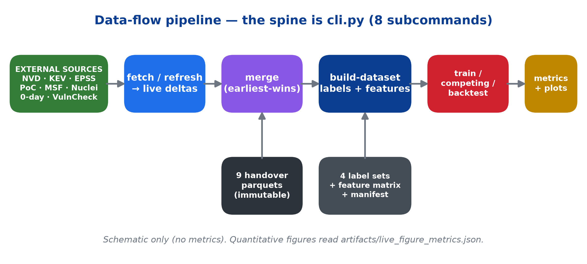
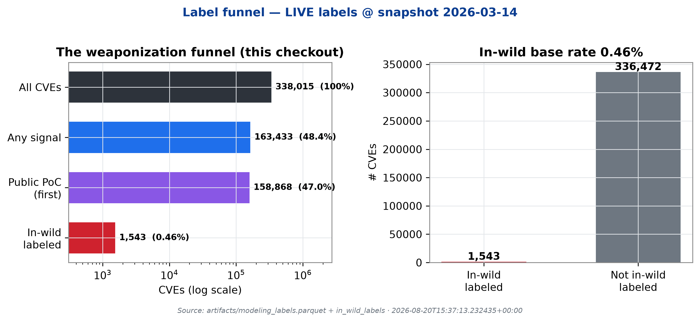
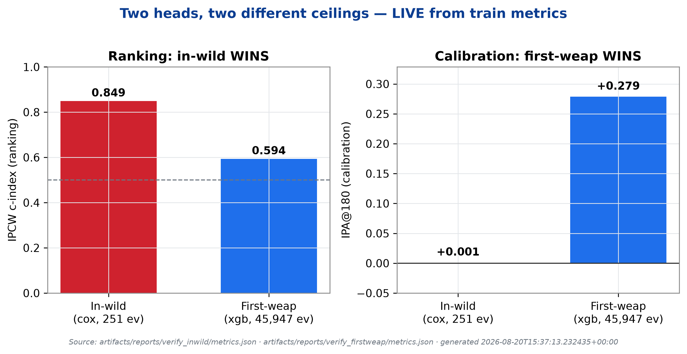
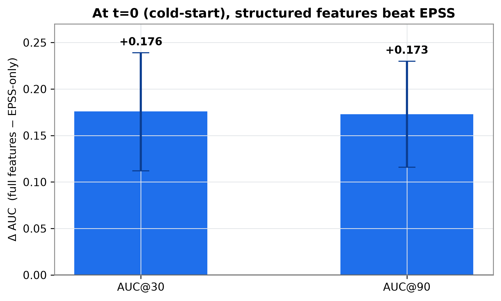
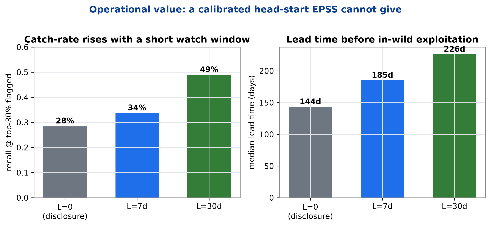
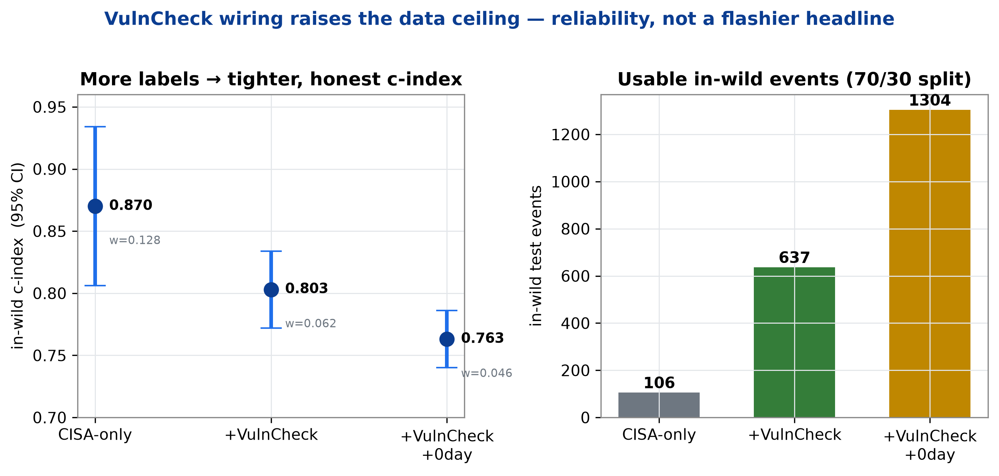
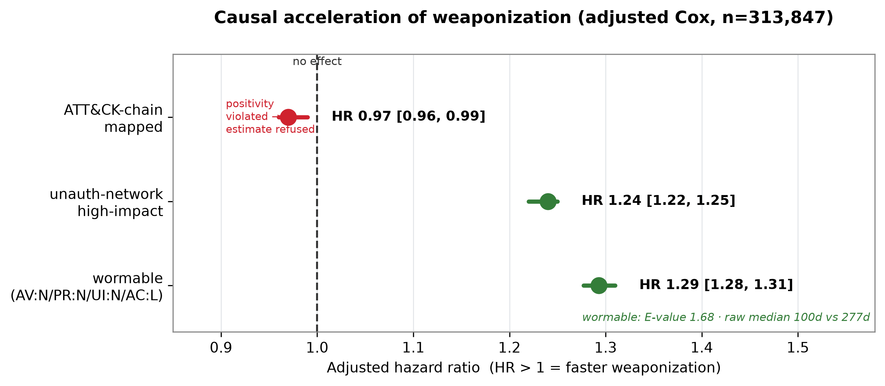
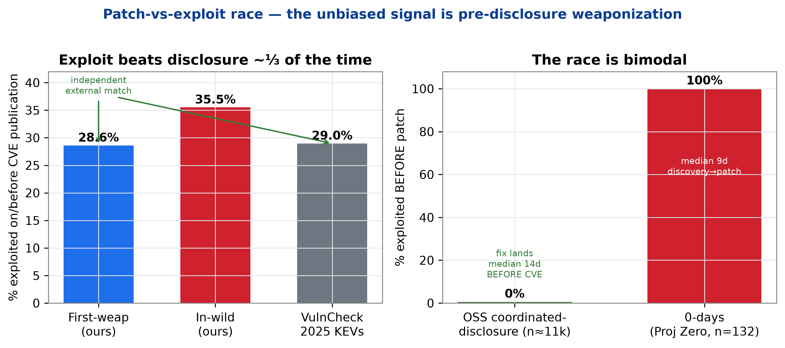

# Temporal Exploit Prediction

This repository contains the dataset-extraction and handover materials for a
research project on predicting when a CVE becomes publicly weaponized.

The project is not a production application. It is a data-engineering and
research handover pack intended to support survival-analysis work over CVE
timelines.

## What this project is about

Security teams already have tools that estimate whether a vulnerability is
severe or likely to be exploited. This project focuses on a different question:

> After a CVE is published, when does public exploitation capability appear?

The dataset supports analysis across several observable weaponization signals:

- public proof-of-concept publication
- Metasploit module availability
- Nuclei template availability
- CISA KEV inclusion
- Google Project Zero 0-day tracking
- daily EPSS score history
- CVE metadata, CWE, CVSS, CPE vendor/product data
- MITRE CWE to CAPEC to ATT&CK mappings

The intended modeling frame is survival analysis / time-to-event prediction.
The strongest framing is "timeline to public weaponization", not simply
"real-world exploitation prediction", because most available events are public
PoC or tooling signals rather than confirmed in-the-wild exploitation.

## Results at a glance

The figures below summarize the project's headline findings. They are generated
**deterministically** (no network, no retraining) from the repo's `artifacts/*.json`
+ `docs/*.md` by [`scripts/build_report_figures.py`](scripts/build_report_figures.py),
and compiled into a 16-page report,
[`docs/project_report_2026-06-23.pdf`](docs/project_report_2026-06-23.pdf). Regenerate
both with the reproduce block at the end of this section.

### The pipeline



*The spine is `cli.py` (7 subcommands): external sources → fetch/refresh → merge
(earliest-wins) → build-dataset (labels + leakage-safe features) → train / competing /
backtest → metrics + plots. The leakage firewall emits only publication-time-knowable
features, each logged in `feature_provenance.csv`.*

### Why the in-wild target is hard



*Of 359,507 CVEs, only 1.38% carry an in-wild label, and EPSS implies roughly 2× more
true exploitation than is labeled (material false-censoring). This rarity — not the
model — sets the in-wild ceiling.*

### Two heads, two ceilings



*The in-wild head (Cox, 251 events) wins on ranking (IPCW c-index 0.849 vs 0.598),
while the first-weaponization head (XGB-AFT, 45,947 events) wins on calibration
(IPA@180 +0.291 vs −0.001). Neither ceiling is set by the model.*

### Structured features beat EPSS at cold-start



*At publication time (t=0), structural features beat an EPSS-only baseline by
+0.176 AUC@30 and +0.173 AUC@90 (paired, walk-forward; 95% CI bars). The lift comes
from structural signal, not EPSS distillation.*

### Operational value: a calibrated head-start



*Recall at the top-30% flagged rises 28% → 34% → 49% across landmarks L=0/7/30d, with
144/185/226-day median lead time before in-wild exploitation — a head-start EPSS's
fixed 30-day window cannot give.*

### More labels raise the data ceiling



*Wiring VulnCheck (+0-day) labels grows usable in-wild test events 106 → 637 → 1,304 and
tightens the honest c-index CI (width 0.128 → 0.046). The point estimate falls as the
easy CISA-only cohort is diluted — reliability, not a flashier headline.*

### What causally accelerates weaponization



*Adjusted Cox (n=313,847): wormable CVEs (AV:N/PR:N/UI:N/AC:L) weaponize faster
(HR 1.29 [1.28, 1.31], E-value 1.68, raw median 100d vs 277d), as do unauth-network
high-impact CVEs (HR 1.24). The ATT&CK-chain estimate is refused (positivity violated).*

### The patch-vs-exploit race



*Exploitation beats disclosure ~⅓ of the time (28.6% first-weap / 35.5% in-wild, matched
by an independent 28.96% on VulnCheck's 2025 KEVs). The race is bimodal: OSS
coordinated-disclosure fixes land ~14d *before* the CVE, while Project Zero 0-days are
100% exploited before the patch.*

**Reproduce the figures and report:**

```bash
.venv/bin/python scripts/build_report_figures.py                  # → docs/figures/*.png (300 dpi)
.venv/bin/python scripts/build_project_report_pdf_2026-06-23.py   # → docs/project_report_2026-06-23.pdf
```

## Project status

High-level checklist of the modeling package (`src/temporal_exploit/`, which
reads the handover parquets and writes to `artifacts/`). The detailed,
always-current tracker is [`docs/progress.md`](docs/progress.md) — keep both in
sync when work lands.

- [x] **Dataset builder** — first-weaponization, per-signal, competing-risks, and in-wild labels; right-censoring at a snapshot; negative-duration flagging
- [x] **Leakage-safe features** — CVSS/CWE/CPE counts, ATT&CK-chain, EPSS-at-publication; snapshot presence kept separate; provenance audit trail; manifest with artifact content hashes
- [x] **Time-based locked train/test splits**
- [x] **Models** — Kaplan-Meier, Cox PH (+ proportional-hazards assumption diagnostics), Random Survival Forest, GPU XGBoost AFT (`--models`), optional GPU DeepSurv (`--deep`)
- [x] **Evaluation** — IPCW concordance, (integrated) Brier, calibration/reliability plots at 7/30/90/180d, event-rate-by-horizon, cascade order, EPSS reconciliation, build-time source-dominance warning
- [x] **Live fetch connectors** (refresh each source to today) — CISA KEV, EPSS, NVD 2.0, Nuclei, PoC (Trickest + Nomi-sec), Metasploit, Project Zero 0-day, Exploit-DB, VulnCheck KEV
- [x] **Competing-risks / multi-state core** — Aalen-Johansen CIFs (unbiased per-cause probabilities), cause-specific Cox per transition, PoC→tooling transition frames, CIF calibration; optional SurvivalBoost (`[boost]` extra); PoC artifact features (transition-safe, provenance-flagged)
- [x] **Merge layer** — reconcile live deltas onto the handover parquets into a unified dataset the builder consumes
- [x] **Leakage groundwork** — `text_safety` masking + description freshness-gating, ready for any future NLP feature
- [x] **Tooling** — CI (ruff + pytest), pre-commit hooks, baked pytest config
- [x] **WSL2 Ubuntu environment** — migrated off OneDrive/Windows (2026-06-12); env managed with uv; EPSS build 2.3× faster; GPU (`cuda:0`) verified
- [x] **Full-feature baseline** — artifacts rebuilt with EPSS-at-publication + CWE + CVSS-vector features (72 cols); xgb early-stopping regression fixed (now opt-in). First-weaponization c-index: **xgb 0.607**, cox 0.588 (cutoff 2024-01-01)
- [x] **Landmark features** (`--landmarks` / `train --landmark`) — tooling presence + EPSS as-of `published+L`, clock restarted at L
- [x] **Statistical-validity wave** (`docs/audit_2026-06-12.md`) — same-day events kept (0.5d), post-snapshot events censored, c-index CIs, censoring-free horizon AUC, IPA, event-rate-scaled Cox penalizer with convergence escalation, KEV-clock filter for in-wild. **Honest headlines: first-weap xgb 0.598 [0.593,0.602]; in-wild static cox 0.849 [0.805,0.893]; in-wild landmark L=30 cox 0.873 [0.810,0.936]** (cutoff 2024-01-01, EPSS-enriched features)
- [x] **Finish-and-improve wave** (2026-06-19 — spec/plan under `docs/superpowers/`) — (1) **live-refreshed every reachable source** (KEV 1,623, Google 0-day 404, **Exploit-DB 25,025 CVEs new**, PoC 168,739, Nuclei 4,208, EPSS daily, **Metasploit live-mined**; NVD bare-date bug fixed but service-side 503; VulnCheck blocked on token) and completed the merge layer (git-mined sources were silently shadowed); (2) **broadened labels** — `exploitdb` tooling source (+23,600 first-weap events; PoC dominance 97%→84.5%), `vulncheck_kev` in-wild wiring, per-source catalog clock-start guard; (3) **mixture-cure model** (`cure.py`, `--models cure`) — on the single split it looked like the only in-wild model with positive IPA, but the **rolling-origin backtest overturned this** (it went negative prospectively; an identifiability artifact — see the backtest entry below). Cox is the in-wild backbone; cure is a documented dead-end; (4) **CIF headline eval** — unbiased Aalen-Johansen CIF vs inflated naive-KM + per-cause held-out c-index in `train-competing`. All within the ≤6–8 GB RAM / ≤7 GB VRAM budget (in-wild run on 68 features, no-EPSS this pass)
- [x] **Memory optimization** (2026-06-19) — EPSS scan **5.8 GB → 0.6 GB** (pyarrow `isin` filter retained per-row-group buffers → `iter_batches` + fixed-size numpy reduction), corpus column projection (112 MB `description` off the default heap), write+free of label frames. The full EPSS+landmark build went from **breaching 8.5 GB to peaking 1.34 GB** process RSS
- [x] **Wave-improvements program** (2026-06-19 — plan under `docs/superpowers/`) — (A) **evaluation rigor**: bootstrap c-index CIs + paired deltas (`bootstrap_cindex_report`) + truncated c-index — *cure↔cox statistically tied, xgb significantly worse*; (B) **cure model**: AIC-selected **log-logistic** latency + held-out isotonic recalibration (`--cure-recalibrate`, EPSS in-wild IPA −0.000→+0.003, opt-in); (C) **leakage-safe NLP description features** (`--description-text`, mixed: xgb +0.006 / cox −0.05); (D) **DeepHit** competing-risks (`train-competing --deep-hit`, `[deep]` extra). Followed by **6 mandatory self-audit rounds** (bootstrap 7m37s→2m50s; cure correctness; a caught EPSS-NaN regression; review findings; fetch HTTP timeouts+retry; git subprocess timeouts). 209 tests green
- [x] **In-wild method head-to-head + rare-event literature review** (2026-06-19) — acting on "don't fixate on one method; research how the field handles this." Prospective rolling-origin backtest across the model classes the survival literature flags as the real Cox challengers (`scripts/inwild_method_headtohead.py`, 15 origins, 396 in-wild events): **cox AUC@90 0.817±0.069 / recall@top-10% 0.51 wins every axis** vs rsf (0.770±0.117 / 0.42) and gbm (0.710±0.093 / 0.40; sksurv Cox-loss GBM is O(n²) — only tractable after subsampling, which discards scarce events). Matches the published consensus (Burk et al. 2026: *no method significantly beats Cox PH* on tabular survival). Cure demoted to a documented dead-end (identifiability artifact). Over-parameterization prune rejected (full+ridge beats dense-12). Full cited review: [`docs/literature_rare_event_exploit_prediction.md`](docs/literature_rare_event_exploit_prediction.md). **Penalized Cox is the in-wild backbone; the ceiling is data-limited (396 events), not model-limited.** Plus 9 reverse-engineering fixes; 221 passed, 3 skipped
- [x] **Deep-research roadmap + flow-change prototypes** (2026-06-19) — "find other methods/pathways/functions to change the flow and get better results; ≥35 papers." **Six parallel literature sweeps (60+ papers, 2022–2026)** → [`docs/research_pathways_2026-06.md`](docs/research_pathways_2026-06.md). Prototyped the two most feasible weak-spot-targeting flow-changes through the backtest, both **honest negative results** confirming the data-limited ceiling: **stacked transfer** (inject the abundant first-weaponization Cox's risk as an in-wild covariate via a new `augment_fn` hook — Δ≈0, the source shares the target's features) and **temperature recalibration** (`calibration.py`, 1-param S^exp(a), provably ranking-preserving — harmful on the mean via event-starved origins, so recalibration stays OFF for in-wild). **Roadmap #1 to actually raise the ceiling: VulnCheck KEV free community API + Shadowserver as new in-wild label sources (2–4× the events).** Plus 6 reverse-engineering fixes. See **►► START HERE** in [`docs/progress.md`](docs/progress.md) for the next-agent handoff.
- [x] **Instant / transition / non-stationarity wave** (2026-06-20, ultracode — an F6-aware plan steering off the EPSS-distilling in-wild head) — **N4** instant-head incentive ablation: the publication-only model **beats the EPSS static floor** on first_weaponization (PR-AUC@30 +0.064 CI[+0.043,+0.084]) but the attacker-incentive flags add ~0 (F6's redundancy verdict holds at t=0); **N5** era-stress harness (`era_stress_eval`): **era-dependent and inconclusive** — train≤2022/test≥2024 = −0.031 degradation (de-confounded) but train≤2023/test≥2025 = +0.074 (opposite sign), with a residual follow-up-window asymmetry; on this signal-starved head the "745d→44d" median collapse does *not* surface as a clear ranking-AUC degradation; **N6** PoC→verified-ExploitDB transition (`build_transition_labels`, `transition_cindex`, registered `poc_to_exploitdb` head): **near-empty (68 events / 162,730 PoC'd CVEs)** because 99.4% of verified-ExploitDB entries *precede* the aggregated PoC date → ExploitDB-verified is **label enrichment, not a target**. Closed with a **5-agent reverse-engineering audit** (13 findings; the era-stress confound fix above came directly from it). 286 passed, 3 skipped.
- [x] **Data-expansion integration** (2026-06-20 — plans `2026-06-20-data-expansion-roadmap.md` + `-integrate-fetched-data.md`) — merged the staged VulnCheck KEV + NVD++ live deltas onto the handover (`data/merged/`: corpus **338k→359k**, **in-wild events 454→4,690**, >10×), rebuilt features (peak RSS 1.49 GB, all EPSS-landmark dynamics cols, 0 NaN), and re-ran the GPU xgb in-wild ablation over 15 rolling origins (`scripts/inwild_merged_eval.py`). **The PR-AUC-vs-EPSS-only bar is CLEARED on the expanded labels** — full vs static-EPSS-only PR-AUC@90 **+0.0134 CI[0.001, 0.026]**, AUC@90 **+0.247** (win 1.00). **But static publication-time EPSS as a feature *hurts* (AUC@90 −0.067 CI[−0.101, −0.032])** — the deployable config is the **no-EPSS structural model** (AUC@90 0.818). The win over EPSS-only comes entirely from non-EPSS structural signal, not EPSS distillation. Absolute PR-AUC stays ~0.02–0.03 (≈1–2% prevalence): more labels raised the floor and tightened CIs but did not exit the rare-event regime.
- [x] **Landmark L=30 EPSS-trajectory + `restart_clock` arm — the STRONG circularity control** (2026-06-21) — does the model still beat an EPSS-only baseline once that baseline is the full landmark **trajectory** (velocity/max/mean/std/rising + days-to-threshold), not the static reading? `scripts/inwild_merged_landmark_eval.py` (+ a current-code re-run on the handover build), `restart_clock` cohort 4,690→2,693, GPU xgb, 15 origins, leak-free ablation (`days_to_epss_*` folded into the EPSS baseline). **On RANKING (AUC) pure structural features beat the complete EPSS baseline by +0.225 AUC@90 (structural-only 0.824 vs EPSS-only 0.599); full vs EPSS-only +0.185 CI[0.112, 0.258].** On precision (PR-AUC) the configs are indistinguishable (underpowered at ~1% prevalence). **This CORRECTS the earlier "F6 = EPSS-trajectory distillation" verdict** — F6 judged on PR-AUC alone and missed the decisive AUC gap; identical on both builds → a metric correction, not data. **EPSS (even the trajectory) is redundant given structural features for ranking; the deployable in-wild config drops EPSS.** Methodological note: at this rarity, AUC is the powered metric for model separation, PR-AUC the deployment metric — report both.

- [x] **Re-center on the multi-state pipeline (RQ2) + label-validity finding** (2026-06-21 — plan `2026-06-21-recenter-pipeline-and-deep-at-scale.md`, writeup `docs/pipeline_characterization_2026-06.md`, 7-round RE audit) — after an alignment check against the professor's framing doc (the spine is the PoC→MSF→Nuclei→KEV pipeline + deep-at-scale, not the data-starved in-wild head). **Headline: the git-mined PoC date conflates true publication with aggregator bulk-index dates for older CVEs** (PoC-before-MSF 31% all-CVE → **81% for published ≥2022**; the dataset surprise the framing doc says to catch pre-modeling; primary suspect for the weak first-weap AUC since PoC is 97% of events). On the clean recent cohort the **pipeline cascades**; competing-risks dependence is negligible for PoC (0.75%) but **material (13–18%) for the rare MSF/Nuclei/KEV causes** (justifies joint competing-risks/DeepHit). Per-transition: PoC→MSF near-chance (xgb 0.53), PoC→Nuclei good (0.79), **PoC→KEV strong (xgb 0.869 [0.839,0.897])** — the conditional "PoC-present → time-to-KEV" beats the unconditional first-weap model (0.60). Phase 2 (deep-vs-Cox at scale) pending.

- [x] **Phase 2: deep-survival-vs-Cox at first-weaponization scale + lossless RAM cut** (2026-06-21 — `docs/deep_survival_headtohead_2026-06.md`, ≥8-round RE audit) — the AI artefact run on the data's strength (212k/101k split) not the data-starved in-wild head. **Discrimination xgb-AFT 0.614 > DeepSurv 0.575 > Cox 0.562; calibration Cox 0.220 < xgb 0.240 < DeepSurv 0.287 (Brier).** DeepSurv wins neither axis; **DeepHit collapsed** on the rare-event imbalance (CIF 3e-6 vs truth 0.19). Cause-specific Cox is the working competing-risks model (poc 0.563 *matches* single-event 0.562 — cross-check; rare causes high but on 6–36 test events). **Verdict: deep survival does not win at scale; classical xgb/Cox are the tools** — exactly the professor's "characterise where they win and lose." Fixed a bootstrap-c-index estimand bug (events-only when events>20k). **Lossless int8 downcast of the ~70 binary flag columns → ~4.5× less RAM (210→44 MB), proven zero quality change** (cox/xgb risk identical to 0.00e+00, deep input bit-identical).

- [x] **Completed the professor's remaining directions** (2026-06-21 — plan `2026-06-21-complete-prof-directions.md`, ≥10-round aggressive RE per deliverable) — **RQ1 Time-to-PoC** (clean cohort cox 0.594; RE found+fixed a dup-cve_id bug; c-index is *incidence*-dominated ~0.59, timing-only just 0.534 — PoC timing is disclosure-logistics-driven), **RQ3 Tactic conditioning** (Defense Evasion/Persistence weaponize fastest ~35–46d vs Credential/Initial Access ~63–72d, log-rank p≈1e-102, survives shuffle+de-overlap+confound checks), and the **required defender interpretation** (`docs/defender_interpretation_2026-06.md`): honest finding that EPSS beats the survival model at publication-time top-k, while the deployable value-add is the **PoC→KEV escalation** (recall@top-10% 0.515 [0.40,0.65], median ~4d / p75 ~11d lead — corrected 2026-06-21 from a stale "~42d" metric bug) — a state-aware composite that complements EPSS. **§"What success could look like" now fully satisfied** (label construction, models+calibration, framing treatment, and the vuln-mgmt interpretation).

- [x] **Remaining-work deliverables + project-wide debug/optimize** (2026-06-21 — spec `2026-06-21-remaining-work-tool-calibration-beatepss-design.md`, RE via ≤2 subagents × multiple loops per item) — closed out the last directions and hardened the codebase:
  - **D1 — downstream triage tool** (`temporal_exploit/triage.py` + `temporal-exploit triage` CLI): per-CVE state-aware action list (PUBLISHED → structural-risk tier + EPSS + RQ3 fast-tactic bump; POC_PRESENT → PoC→KEV escalation). Scores the held-out cohort only; 54,388 CVEs, 1.25 GB RAM. RE caught + fixed a **lead-time metric bug** (`operating_points` reported `horizon−duration` ≈ 86d instead of the true ~4d PoC→KEV lead) and a `tiers()` no-signal flood.
  - **D2 — calibration at concrete horizons** (`calibration.calibration_slope_intercept`, `scripts/calibration_by_horizon.py`): reuses the existing KM-within-bin reliability + per-horizon Brier; adds slope/intercept + bootstrap CIs. Finding: **equal discrimination (c-index 0.584≈0.585) but Cox is far better calibrated than XGB-AFT** (slope ~0.6 vs ~0.2); Cox still over-predicts at long horizons.
  - **D3 — autoresearch-style gated hill-climb** (`temporal_exploit/hillclimb.py` + `scripts/beat_epss_hillclimb.py`): generate-and-keep search over leakage-safe feature groups, accept gate = *significant* paired per-origin delta + shuffle-null + leakage-safe-by-construction + plateau stop. **Result (RE-verified, leakage-free): EPSS+CVSS significantly beats EPSS-only at recall@top-10%@30d (0.103→0.130, paired Δ+0.027 CI[0.013,0.042], robust across top-5%/7d/90d/180d), then plateaus** — no other structural group helps, confirming the data-limited ceiling.
  - **DeepHit collapse fixed** (`docs/deephit_imbalance_fix_2026-06.md`): debugged to root cause — *not* the loss `alpha` (raising it made the collapse worse) and *not* bin count, but **bin placement**. Quantile time-discretization recovers CIF@90 from ~3e-6 to ~0.17 (AJ truth ~0.10) with better concordance; now the default. Usable, still not better than Cox (data-limited).
  - **Project-wide audit (2 agents) + 6 optimizations, all RE-verified bit-identical:** earliest-event hoist out of the backtest loop (**7.4× faster** label-building, byte-identical), vectorized KM for the calibration bootstrap (**~13s→2.6s**), vectorized `_per_subject_nll` and Breslow `H0` (O(n²)→O(n log n)), DeepHit `batch_size` 256→1024 (GPU util 25%→75%) + single `predict_cif`. Accuracy audit came back **clean** (leakage/metrics/labels/splits verified sound); fixed minor edge cases (triage EPSS no-signal guard, dead ATT&CK keys).

This realizes steps 2–8 of the plan below; step 1 (handover) is the source material.

## Scope for improvement (for the next agent)

Open threads — the detailed backlog lives in [`docs/progress.md`](docs/progress.md):

- **Cure model — a documented dead-end on in-wild (do not revive without a KM plateau).** The single-split IPA win did not survive the rolling-origin backtest (cure went negative prospectively; recalibration made it worse, IPA@180 −0.27). Root cause is theoretical, not a tuning bug: a mixture-cure fraction is only identifiable when the Kaplan-Meier curve plateaus above zero, and our ~99.5%-censored in-wild target is administratively censored, not a cured population (Li/Taylor/Sy 2001 — see `docs/literature_rare_event_exploit_prediction.md`). Held-out isotonic recalibration is itself the fragile choice the rare-event literature warns against (isotonic overfits with few events). **Cox is the in-wild backbone.**
- **VulnCheck KEV + NVD live pulls** — VulnCheck (in-wild broadener) is wired+tested but needs `VULNCHECK_API_TOKEN`; NVD corpus refresh is blocked by service-side 503 (bare-date bug fixed; 503/429 retry+backoff added). Run both when credentials/availability allow; honeypot feeds still unwired.
- **Audit leftovers** (`docs/audit_2026-06-12.md`) — **bootstrap CIs + paired deltas + exact truncated c-index landed** (`bootstrap_cindex_report`, `truncated_cindex`), **mixture-cure** (`cure.py`) and **per-cause test c-index** landed. Effectively closed.
- **Deep-model depth** — DeepSurv (`--deep`) and **DeepHit competing-risks** (`train-competing --deep-hit`) are wired (`[deep]` extra, lazy torch, CUDA auto). Open: architecture/epoch tuning; DeepHit's live validation needs the extra installed (gated tests skip without torch).
- **NLP features** — **landed** (`nlp_features.py`, `--description-text`): leakage-safe length/keyword features. Mixed value (helps xgb, hurts cox); a richer (capped/log-scaled) or embedding-based variant is the next step if text signal matters.
- **Scheduled incremental refresh** — `merge` reconciles deltas, but there is no automated NVD `lastMod`-window pull to keep a live dataset current on a schedule.
- **Project Zero dates** — the live sheet leaves "Date Discovered" blank for the most recent rows (source-side); consider a disclosure-date fallback.
- **WSL RAM cap** — WSL currently sees ~7 GB; set `memory=12GB` in `.wslconfig` (+ `wsl --shutdown`) before running RSF (~10 GB) or concurrent heavy jobs.
- **Backtest c-index not aggregated** (found in the N4–N6 audit) — `rolling_origin_backtest` computes per-origin IPCW + truncated c-index inside `evaluate_survival` but never extracts them into the aggregate, so `aggregate.c_index_*` is absent for every head. Cheap fix (extract + average in `_aggregate`); deferred because it touches shared code and the competing-risk heads want the cause-specific variant. The transition head works around it with an explicit held-out `transition_cindex`.
- **Transition machinery is reusable** — `build_transition_labels(from_source, to_source, competing_sources)` + the `poc_to_exploitdb` registration generalize to PoC→Metasploit / PoC→KEV escalation heads; ExploitDB was just the wrong `to_source` (it *is* a PoC source). A Metasploit/Nuclei transition (tooling that genuinely post-dates the PoC) is the higher-signal next target.
- **Follow-up-matched era-stress** (found in the N4–N6 fix-verification round) — `era_stress_eval` de-confounded the train censoring regime, but the in-period TEST still has less follow-up than the cross-era test, so at a fixed horizon they are scored on differently-aged within-window slices. The two era pairs disagree in sign (−0.031 vs +0.074), so the current result is directional only. To make degradation a clean measurement, administratively cap both test windows to the same follow-up length before scoring.

## Repository layout

```text
dataset_extraction-20260608T210903Z-3-002/
  dataset_extraction/
    extract/                  Mongo/VRS extraction scripts
    enrich/                   external timestamp and metadata enrichment
    handover/                 student-facing data dictionary
    out/                      generated parquet outputs, ignored by Git
    README.md                 operator notes for rebuilding the handover pack
    temporal_exploit_prediction.md
    run_pipeline.sh
    view_parquet.py
    compare_outputs.py
    requirements.txt
```

Large generated datasets are intentionally ignored by Git. They should be
handled as local artifacts, object-storage artifacts, or separate release files.

## Current source-control policy

Track:

- extraction and enrichment source code
- project documentation
- handover documentation
- dependency manifests
- helper scripts

Do not track:

- parquet outputs
- EPSS history dumps
- local caches
- virtual environments
- logs
- secrets or `.env` files

This keeps the repository useful for collaboration without making normal Git
operations depend on multi-GB binary data.

## Plan for creating the research project

### 1. Stabilize the handover data

- Confirm the nine expected parquet outputs exist.
- Keep generated data out of Git.
- Document the provenance, known biases, and leakage risks for each source.
- Treat the current extraction scripts as reproducibility material, not as the
  main modeling code.

### 2. Build the analysis dataset

- Start from `cve_corpus.parquet` as the per-CVE base table.
- Use `published` as the clock origin.
- Join dated event sources:
  - PoC dates
  - Metasploit dates
  - Nuclei dates
  - CISA KEV dates
  - Google 0-day dates
- Define one or more event labels:
  - time to first public weaponization signal
  - time to PoC
  - time to Metasploit
  - time to Nuclei
  - time to confirmed in-wild signal
- Define a fixed snapshot date and right-censor CVEs with no observed event.

### 3. Avoid temporal leakage

- Use only features knowable at or near publication time for prediction.
- Do not use snapshot-time feed-presence flags as predictors for historical
  events.
- Treat current CVE descriptions carefully because they may contain post-event
  text such as KEV or active-exploitation mentions.
- Use time-based train/test splitting, not random K-fold splitting.

### 4. Run exploratory analysis first

- Plot Kaplan-Meier curves for key event definitions.
- Compare event timing by CVSS severity, CWE class, vendor/product family, and
  ATT&CK tactic where available.
- Quantify censoring and source dominance, especially PoC dominance.
- Identify negative durations and decide whether to drop, floor, or analyze
  them separately.

### 5. Train baseline survival models

- Start with simple, defensible baselines:
  - Kaplan-Meier reference curves
  - Cox proportional hazards
  - random survival forest if available
- Evaluate discrimination and calibration at fixed horizons:
  - 7 days
  - 30 days
  - 90 days
  - 180 days

### 6. Add stronger ML models if time allows

- Test learned text features from CVE descriptions only after addressing
  leakage.
- Compare deep survival models such as DeepSurv or DeepHit against classical
  baselines.
- Explore competing-risk or multi-state modeling for PoC to Metasploit to
  Nuclei to KEV progression.

### 7. Reconcile results against EPSS

- Compare the survival model's multi-horizon predictions with EPSS.
- Identify CVEs where EPSS is high but public weaponization is slow, and where
  EPSS is low but weaponization is fast.
- Frame EPSS as complementary: EPSS predicts exploitation probability in a
  fixed 30-day window, while this project models weaponization timing.

### 8. Produce final research outputs

- A reproducible modeling dataset builder.
- Locked train/test CVE ID splits.
- Survival-analysis notebooks or scripts.
- Evaluation tables and calibration plots.
- A written methodology covering censoring, leakage, event definitions, source
  bias, and limitations.

## Quick start

From the dataset folder:

```bash
cd dataset_extraction-20260608T210903Z-3-002/dataset_extraction
python -m venv .venv
source .venv/bin/activate
pip install -r requirements.txt
python view_parquet.py --list
```

On Windows PowerShell, activate the environment with:

```powershell
.\.venv\Scripts\Activate.ps1
```

## Modeling quick start

From the repo root (env managed with [uv](https://docs.astral.sh/uv/)):

```bash
uv venv --python 3.12 .venv
uv pip install -p .venv/bin/python -e ".[dev,xgb,boost]"
.venv/bin/temporal-exploit build-dataset --out-dir dataset_extraction-20260608T210903Z-3-002/dataset_extraction/out --artifact-dir artifacts --snapshot-date 2026-03-14
.venv/bin/python -m pytest
```

Generated artifacts land in `artifacts/` (ignored by Git): `modeling_labels.parquet`,
`publication_features.parquet`, and `manifest.json`. Methodology is documented in
`docs/modeling_methodology.md`.

### Downstream triage tool (`triage`)

The state-aware triage tool turns the predictions into a per-CVE action list (the
§"exceptional work" downstream-integration deliverable). It scores only the held-out
recent cohort (no in-sample optimism) and **switches tool by observable state**:
`PUBLISHED` → structural first-weaponization risk tier + EPSS + RQ3 fast-tactic bump;
`POC_PRESENT` → escalate via the PoC→KEV model.

```bash
.venv/bin/temporal-exploit triage \
  --out-dir data/merged --artifact-dir artifacts/merged --report-dir artifacts/merged \
  --snapshot-date 2026-03-14 --min-pub 2021-01-01
```

Writes `triage_scored.parquet` (all scored CVEs), `triage_top.csv` (top 200), and
`triage_summary.json`. Decision logic is the pure, unit-tested `temporal_exploit.triage`
module; the rationale is in `docs/defender_interpretation_2026-06.md`.

## Memory: check RAM/VRAM limits before any model work

**Always check free RAM (and VRAM if using `xgb`/`--deep`) before building or
training** — the full dataset is 338k CVEs and the heavier paths page a 16 GB
laptop into the ground if something else is hogging memory:

```powershell
Get-CimInstance Win32_OperatingSystem | Select @{n='FreeRAM_GB';e={[math]::Round($_.FreePhysicalMemory/1MB,2)}}
nvidia-smi --query-gpu=memory.used,memory.total --format=csv
```

Rules of thumb on the full dataset:

- `train --models cox,xgb` — the laptop-friendly default to prefer; XGBoost AFT
  trains on the GPU when present and its survival curves are closed-form, so
  evaluation memory stays flat.
- `train --models cox,rsf` — the RSF is the RAM hog: the fitted forest holds
  per-leaf survival curves (~5 GB resident) plus batched prediction buffers.
  Budget ~10 GB free RAM and close other heavy apps first.
- `build-dataset --epss-path ...` — the 375M-row EPSS history is streamed with
  `iter_batches` + a fixed-size per-CVE numpy reduction (**~0.6 GB peak**; an
  earlier pyarrow `isin` pushdown filter retained ~5.8 GB). The full
  EPSS+landmark build peaks ~1.3 GB process RSS, well within the laptop budget.
- `train --deep` — DeepSurv evaluation is sampled (20k rows) to bound the
  survival-matrix size; training itself runs on the GPU.
- Run one heavy job at a time. Two of the above concurrently is what causes
  the swap-death.

## Main documentation

Read these in order:

1. `dataset_extraction-20260608T210903Z-3-002/dataset_extraction/temporal_exploit_prediction.md`
2. `dataset_extraction-20260608T210903Z-3-002/dataset_extraction/handover/README.md`
3. `dataset_extraction-20260608T210903Z-3-002/dataset_extraction/README.md`

