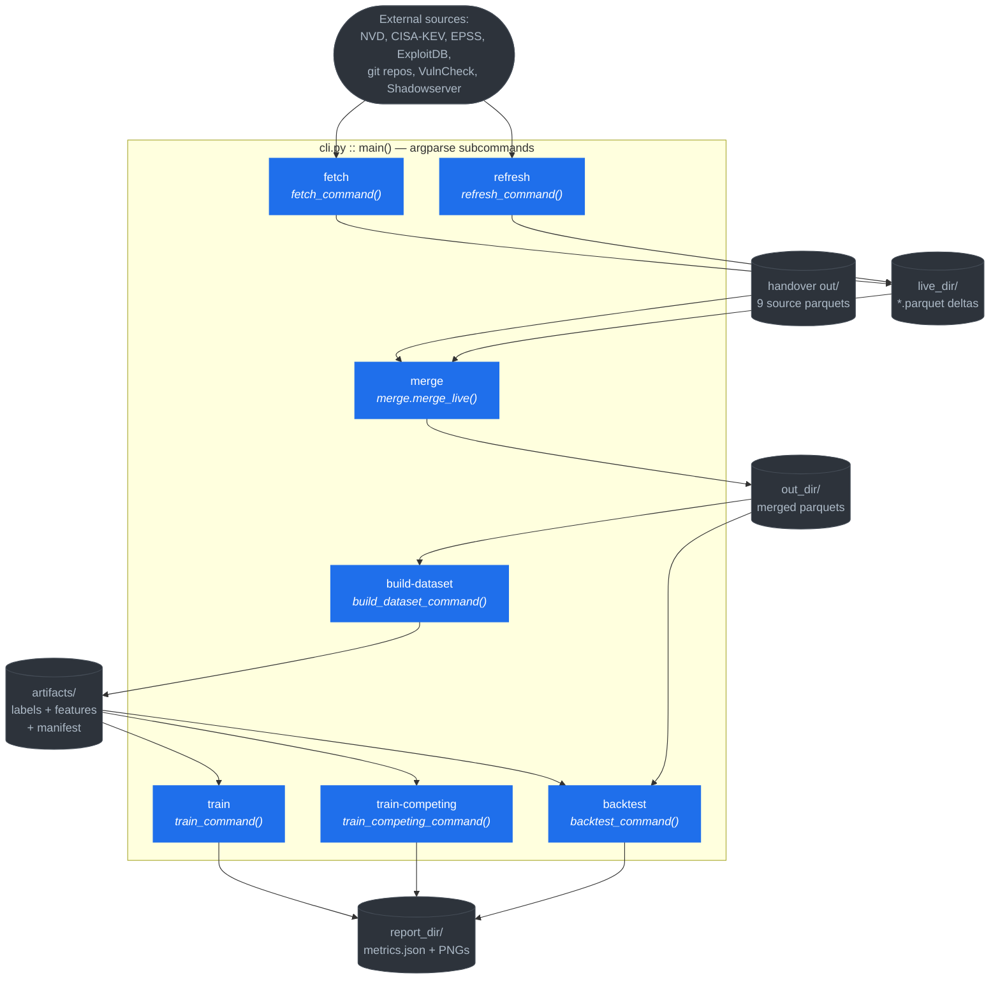
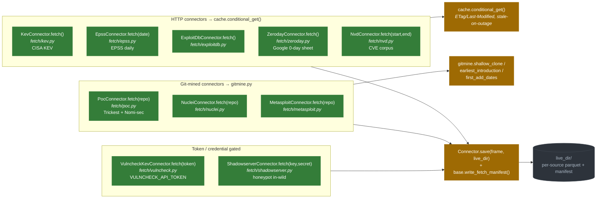
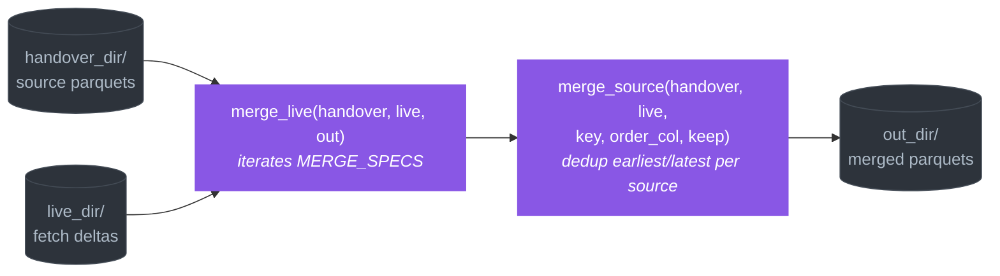
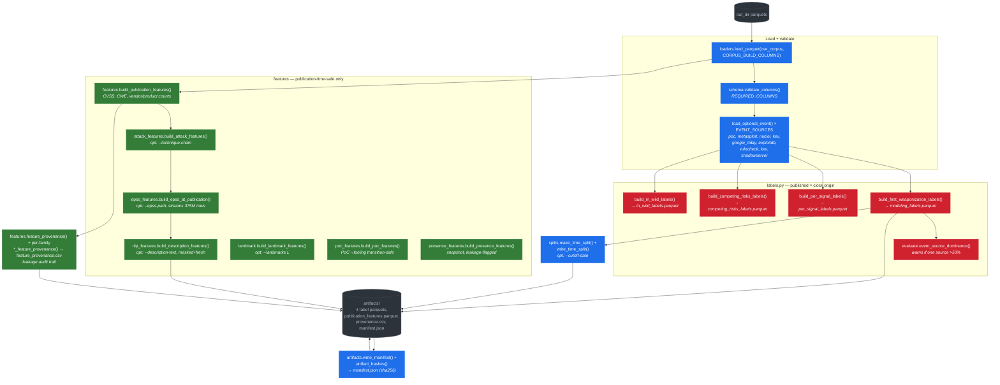
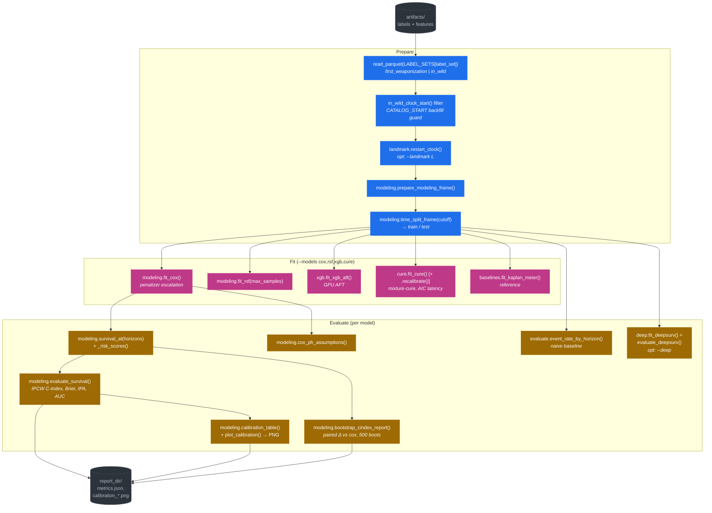
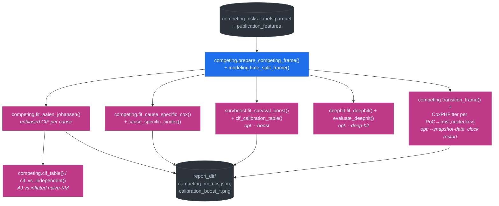
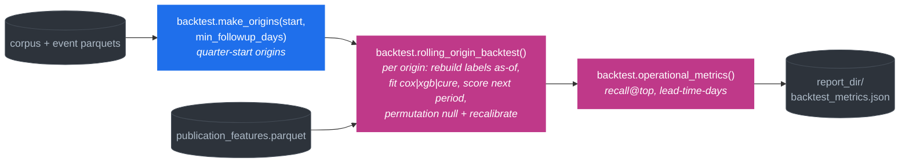

# Architecture & Data Flow — `temporal_exploit`

Visual map of the full pipeline. Every box names the **actual function/class** that
does the work and the **module** it lives in (`module.py :: function`). Diagrams are
[Mermaid](https://mermaid.js.org/) — they render in GitHub, VS Code (with the Mermaid
extension), and most markdown viewers.

The spine is `cli.py`. Five CLI subcommands drive everything:
`fetch` / `refresh` → `merge` → `build-dataset` → `train` / `train-competing` / `backtest`.

---

## 0. Top-level command map



---

## 1. Fetch / Refresh — pulling live data (`fetch/` package)

All connectors subclass `fetch/base.py :: Connector` (abstract `fetch()` + shared
`save()`). HTTP sources go through `fetch/cache.py :: conditional_get()` (ETag /
Last-Modified, serves stale on outage). Git-mined sources use `fetch/gitmine.py`
helpers (`shallow_clone`, `earliest_introduction`, `first_add_dates`).



**`refresh_command()`** runs all keyless HTTP + git sources in one shot (errors per
source are caught, not fatal), then conditionally adds VulnCheck (if
`VULNCHECK_API_TOKEN`) and Shadowserver (if credentials) — otherwise records them as
`skipped`. **`fetch_command()`** runs one named source on demand.

---

## 2. Merge — live deltas onto handover parquets (`merge.py`)



`MERGE_SPECS` holds the per-source dedup key + ordering (e.g. keep *earliest*
`first_seen`, keep *latest* EPSS reading).

---

## 3. build-dataset — labels + features (`build_dataset_command`)

This is the integration hub. Loads the corpus + every optional event parquet, builds
**four label sets** and the **feature matrix**, then writes artifacts + a manifest.



**Leakage safety** (non-negotiable): default features exclude post-event description
text, snapshot presence flags, and snapshot EPSS. `text_safety.mask_leakage_terms()` +
`description_is_fresh()` guard the opt-in NLP path.

---

## 4. train — survival models + evaluation (`train_command`)



---

## 5. train-competing — competing risks & transitions (`train_competing_command`)



---

## 6. backtest — rolling-origin walk-forward (`backtest_command` → `backtest.py`)



Each origin only trains on what was knowable then (`label_set`, `clock_start` from
`in_wild_clock_start()`); honest walk-forward, no peeking.

---

## Module quick-reference

| Layer | Module | Role |
|---|---|---|
| **Spine** | `cli.py` | argparse + 7 `*_command()` orchestrators |
| **Fetch** | `fetch/base.py` | `Connector` ABC, `save()`, `write_fetch_manifest()` |
| | `fetch/cache.py` | `conditional_get()` ETag cache |
| | `fetch/gitmine.py` | git-history CVE mining helpers |
| | `fetch/{kev,epss,nvd,exploitdb,zeroday}.py` | HTTP connectors |
| | `fetch/{poc,nuclei,metasploit}.py` | git-mined connectors |
| | `fetch/{vulncheck,shadowserver}.py` | token/cred-gated in-wild |
| **Merge** | `merge.py` | `merge_live()` / `merge_source()` + `MERGE_SPECS` |
| **Load** | `loaders.py`, `schema.py` | parquet load + column validation |
| **Labels** | `labels.py` | 4 label builders, `published` = origin |
| **Features** | `features.py` | publication-time CVSS/CWE/CPE |
| | `attack_features.py`, `epss_features.py` | ATT&CK + EPSS-at-publication |
| | `nlp_features.py`, `text_safety.py` | masked, freshness-gated text |
| | `landmark.py`, `poc_features.py`, `presence_features.py` | post-pub / transition / snapshot |
| **Split** | `splits.py` | time-based `make_time_split()` |
| **Models** | `modeling.py` | Cox / RSF / GBM + evaluate + calibration + bootstrap |
| | `baselines.py` | Kaplan-Meier, Cox baseline |
| | `cure.py`, `xgb.py`, `deep.py`, `deephit.py`, `survboost.py` | cure / AFT / neural / competing-risk models |
| | `competing.py` | Aalen-Johansen, cause-specific Cox, transitions |
| | `calibration.py` | temperature recalibration |
| **Eval** | `evaluate.py`, `backtest.py`, `simulate.py` | descriptive stats, walk-forward, synthetic DGP |
| **Artifacts** | `artifacts.py`, `config.py` | manifest + hashes, paths |
```
